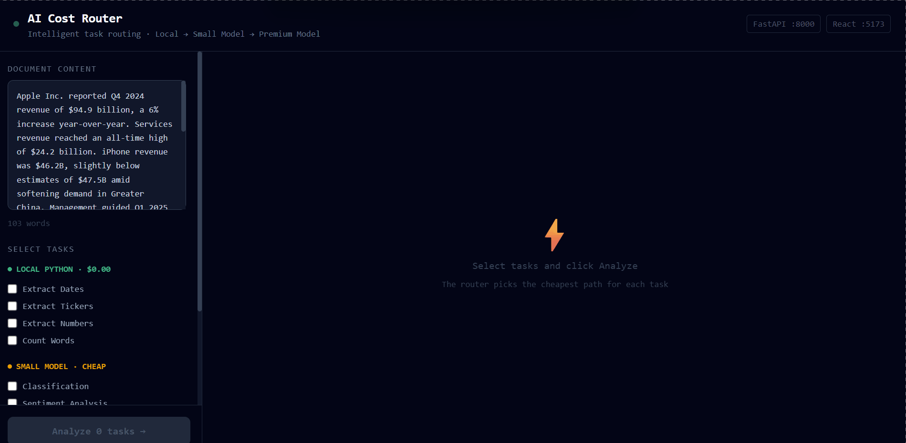

# AI Cost Router

Intelligent task routing that selects the cheapest AI execution path and proves it with live cost tracking.

## The Problem

Most AI systems route every task to a premium LLM. Extracting a date? Premium model. Classifying a sentence? Premium model. That is expensive and unnecessary.

## The Solution

A routing layer that dispatches each task to the lowest-cost tier capable of handling it.

| Tier | Execution | Cost | Example Tasks |
|------|-----------|------|---------------|
| LOCAL | Python regex | 0.00 USD | Date extraction, word count, ticker parsing |
| SMALL | Gemini Flash | 0.0002 USD | Classification, sentiment, short summaries |
| PREMIUM | Claude / Gemini | 0.003 USD | Executive summaries, risk analysis, investment thesis |

Running 8 mixed tasks achieves 85 percent cost savings vs sending everything to a premium model.

## Quick Start

Backend: cd backend, activate venv, pip install -r requirements.txt, add GEMINI_API_KEY to .env, run python -m uvicorn main:app --reload

Frontend: cd frontend, npm install, npm run dev

Dashboard runs at http://localhost:5173

Only GEMINI_API_KEY is required. Get one free at https://aistudio.google.com/apikey

## Tech Stack

Backend: Python 3.12, FastAPI, Pydantic v2, python-dotenv
Frontend: React 18, Vite, Tailwind CSS v3, Recharts
AI: Google Gemini primary, OpenAI and Anthropic as optional fallbacks

## API Endpoints

GET /routes - full routing map and cost per tier
POST /analyze - single task routing and result
POST /batch - multiple tasks and aggregate savings summary

## License

MIT
